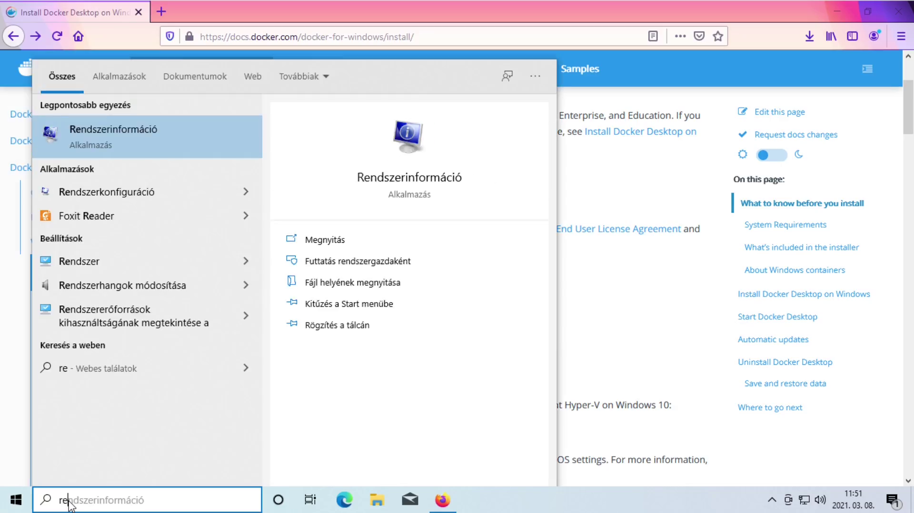

# emtsv és Docker telepítése Windows 10-re

Ezt az útmutatót azoknak ajánljuk, akik magyar szöveget szeretnének feldolgozni, de nincsen meg a technikai tudásuk ahhoz, hogy önállóan feltelepítsék Windowsra az [emtsv](https://github.com/dlt-rilmta/emtsv)-t és az ehhez szükséges [Docker](https://hu.wikipedia.org/wiki/Docker_(szoftver))t.

## Mi micsoda?

### 1. Docker

A Wikipédia alapján a Docker operációs rendszer szintű virtualizációt végez. Mintha lenne egy számítógép a számítógépen belül: egy-egy programot ezerféleképpen lehet telepíteni, de ha egy egész konténert (“virtuális számítógépet”) töltünk le, akkor garantálható, hogy mindenkinél ugyanúgy fut a program. 

### 2. emtsv

A szövegfeldolgozó rendszer, amit telepíteni szeretnénk. Ez jelenleg a legpontosabb, legjobban teljesítő eszköz magyar nyelvre.

### 3. Linux

Operációs rendszer, mint a Windows, csak nem ablak, hanem [pingvin](https://en.wikipedia.org/wiki/Linux) a jele. Ez a rendszer fut a Dockerben, amin belül fut az emtsv. Fontos, hogy a Linuxos alrendszer angolul a ***W**indows **S**ubsytem for **L**inux* nevet viseli, aminek két verziója van: **WSL1**, **WSL2**. Először a WSL1-et, majd a WSL2-t telepítjük.

## Telepítés

A telepítésnek három fő lépése van: a Linux alrendszer telepítése, a Docker telepítése, és az emtsv telepítése Dockeren belül. Ebben a sorrendben lesz egyre könnyebb a telepítés. Egy kísérővideó megtekinthető az alábbi linken: [https://www.youtube.com/watch?v=3R-9uMh1yPg](https://www.youtube.com/watch?v=3R-9uMh1yPg).

### Linux alrendszer telepítése

A [hivatalos Microsoft útmutatót](https://docs.microsoft.com/en-us/windows/wsl/install-win10) követjük az alábbi lépésekben.

1. Windows verzió ellenőrzése: Start menü ➞ Kereső: Rendszerinformáció ➞ Verziószám. A verziószámnak 18363-nál nagyobbnak kell lennie, hogy tudjunk telepíteni.




2. WSL1 telepítése: Vezérlőpult ➞ Programok ➞ Windows-szolgáltatások be- és kikapcsolása ➞ Linuxos Windows alrendszer bepipálása ☑️. Ezután kicsit telepít a Windows, majd indítsunk újra.


3. Virtualizáció bekapcsolása: Start menü ➞ Kereső: PowerShell (futtatás rendszergazdaként) ➞ Másoljuk be, majd enter: 

```powershell
dism.exe /online /enable-feature /featurename:VirtualMachinePlatform /all /norestart
```


4. WSL2 telepítése: Töltsük le az alábbi fájlt, indítsuk el és telepítsük: [https://wslstorestorage.blob.core.windows.net/wslblob/wsl_update_x64.msi](https://wslstorestorage.blob.core.windows.net/wslblob/wsl_update_x64.msi). Itt már feltűnik a pingvin motívum.


5. WSL2 beállítása alapértelmezettként: Start menü ➞ Kereső: PowerShell (futtatás rendszergazdaként) ➞ Másoljuk be, majd enter: 

```powershell
wsl --set-default-version 2
```


6. Indítsunk újra.

### Docker telepítése

1. Docker letöltése: [https://hub.docker.com/editions/community/docker-ce-desktop-windows/](https://hub.docker.com/editions/community/docker-ce-desktop-windows/) ➞ Get Docker.


2. Docker telepítése: Nyissuk meg a letöltött fájlt, hagyjunk mindent alapértelmezetten és telepítsünk. Akár 15-30 percig is eltarthat a telepítés.


3. Telepítés után felajánlja nekünk a Docker, hogy jelentkezzünk ki és be (vagy indítsunk újra), ezt tegyük is meg.

4. Automatikusan elindul a Docker; amennyiben látjuk a Docker kezdőoldalát vagy a tálcán megjelent a bálna logó , sikerrel jártunk. Amennyiben nem, próbáljuk megoldani a hibát, ha nem megy, keressünk egy Dockerben járatos embert.


### emtsv telepítése

1. Töltsük le az emtsv konténert: Start menü ➞ Kereső: PowerShell (futtatás rendszergazdaként) ➞ Másoljuk be, majd enter, ez 15-30 percig telepít ismét:

```docker
docker pull mtaril/emtsv
```


2. Maradjunk a már megnyitott Powershellben (vagy nyissunk egy újat rendszergazdaként), üssük be, majd enter: 

```docker
docker run --rm -p5000:5000 -it mtaril/emtsv
```


3. A Docker konténer elindult és a böngészőn keresztül tudunk kapcsolódni az emtsv-hez a [localhost:5000](localhost:5000) linken.


4. A konténert leállítani kétféleképpen tudjuk: a Powershell ablakban ütünk egy Ctrl+C billentyűkombinációt (ilyenkor visszaigazol, hogy *Killing workers*), vagy megnyitjuk az ikonok között a Dockert, és a Containers/Apps fülön leállítjuk a konténert a STOP ⬛ gombra kattintva.

## emtsv/Docker használata, tippek, trükkök

- Amennyiben később használjuk az emtsv-t, elég csak megnyitni a Powershellt és beütni a `docker run --rm -p5000:5000 -it mtaril/emtsv` parancsot. 

- A Docker háttérben futtatása erőforrásigényes. Amennyiben gyengébb számítógépet használunk, érdemes lehet beállítani, hogy ne induljon el automatikusan: Docker ➞ *Settings* ⚙️ ➞ *General* ➞ ☐ *Start Docker Desktop when you log in* opciónál a pipa törlése. Ilyenkor ha a Dockert akarjuk használni, el kell indítani Asztalról/Start Menüből, megvárni, amíg a bálna megtelik, és utána már ki lehet adni Powershellben a parancsot.

- Négyféle módon lehet kommunikálni az emtsv-vel: a böngészőben beütve a szöveget, a böngészőbe feltöltve a szöveget, parancssorból átadva a szöveget a futó szolgáltatásnak, vagy parancssorból futtatva adott fájlon. Az első kettő nagyon kényelmes, a harmadik mód elengedhetetlen bármilyen bonyolultabb programozási feladathoz, a negyedik pedig akkor hasznos, ha tudjuk mit csinálunk és csak gyorsan kell egy adott fájlra lefuttatni az emtsv-t.

- Néhány modul betöltése sok ideig eltart, ne lepődjünk meg, hogyha például dependenciaelemeznénk, és a process gombra rákattintás után *semmi* nem történik egy ideig - a feladatkezelőben (Ctrl+Shift+Esc) meg lehet nézni, hogy ténylegesen történik-e valami a háttérben, ha magas a CPU használat Teljesítmény fülön (ha nem látszik a fül ➞ Több részlet), akkor valószínűleg dolgozik.

- A Docker viszonylag lassan indul el, az ikonok között a jobb alsó sarokban látjuk, hogy elindult-e már: amennyiben a bálna háta üres, akkor még készül elindulni, amennyiben a bálna hátán kis kockák izeg-mozognak, éppen indul el, amennyiben a bálna háta meg van pakolva kockákkal (konténerekkel), elindult a Docker és tudjuk használni